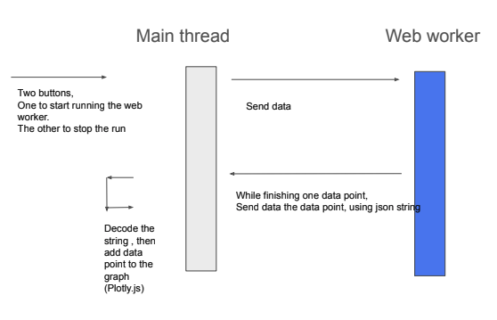

# GranatumX_dev_2022

This github contains prototypes of visualization tools. It can be useful for batch processing on genetic data. Currently, we still have package installation issue.

## Main Idea
We use JS webworker for multi-threading. The webwork takes in chunked dataset and run ML iteratively. Once one chunk is finished, it sends the result to the main thread using Json string. User can terminate the webwork if the result is not desirable. 

For ML unit, we use Pyodide convert Python code to JS runnable binary code. Currently, we can run scikit-learn but not scanpy which consums C-Python. This leaves for future endeavor.

For graphing, we use Plotly.js to deliver result from each chunked data in real time.

## Prototypes in this repo
1. The first runs K-means. The webworker send clustered data by chunk.
2. THe second runs Normal distribution. The webworker send generated data point by point.

## To run
go to each folder and then run the following command

$ python -m http.server 8000
